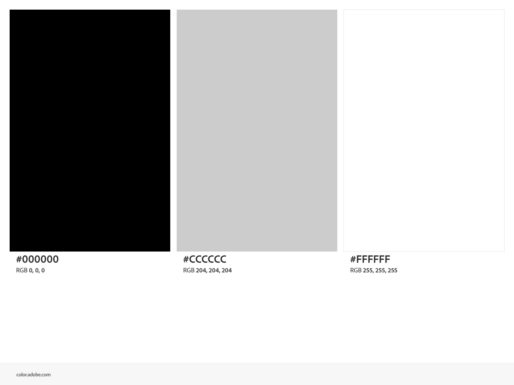

# Krutarth Joshi - Portfolio

Krutarth Joshi portfolio website made with HTML5 and CSS3

## Files

- index.html - home page
- about.html - about me page
- projects.html - projects page
- contact.html - contact me page
- full.css - style sheet for laptops and desktops
- tablet.css - style sheet for tablets
- smartphone.css - style sheet for smartphones
- KJphotonew.jpg - photo for the about me page
- portfoliovideo.mp4 - video for the about me page
- poster.jpg - poster image for the video
- colourscheme.jpeg - colour scheme made with Adobe Color

## Screen Sizes

The site uses three style sheets, one for each screen size. A media query on each link tag picks which one is used.

- smartphone.css uses 480px and smaller as most phones are between 320px and 430px wide, so 480px covers them
- tablet.css uses 481px to 959px as most tablets are between 768px and 834px wide. 
- full.css uses 960px and larger as 960px is the full size screen width, but laptop and desktop screens are wider than this.

The page width is set as a percentage (90% on laptops, 95% on tablets and smartphones), so the page stretches and shrinks with the screen, meaning fluid design is maintained. 

## Gradients

- The header uses an angled linear gradient at 45 degrees, going from white to light grey (#CCCCCC)
- The footer uses a linear gradient from top to bottom, going from light grey (#CCCCCC) to white

Both gradients are used on every page and are in all three style sheets.

## Colour Scheme

- White (#FFFFFF) is used for the page background and the gradients
- Black (#000000) is used for the text
- Light grey (#CCCCCC) is used for the header, the footer and the gradients

The font is Arial, with sans serif as the backup.

The colour scheme was made with Adobe Color:

